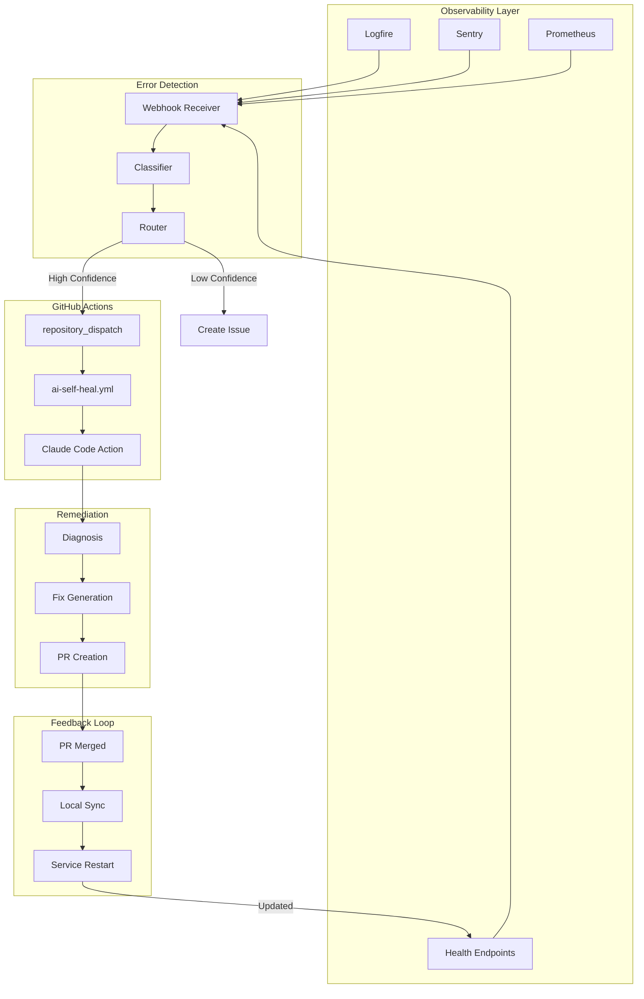

# Self-Healing Infrastructure Design

## Overview

This document describes the infrastructure integration for autonomous Claude Code operation with self-healing capabilities. The system enables automated error detection, classification, and remediation through GitHub Actions triggered by repository dispatch events.

## Architecture Diagram

```
                                    SELF-HEALING INFRASTRUCTURE
+-------------------------------------------------------------------------------------------+
|                                                                                           |
|  +------------------+     +------------------+     +------------------+                   |
|  |   Local Dev      |     |   Production     |     |   Staging        |                   |
|  |   Environment    |     |   Environment    |     |   Environment    |                   |
|  +--------+---------+     +--------+---------+     +--------+---------+                   |
|           |                        |                        |                             |
|           v                        v                        v                             |
|  +--------+---------+     +--------+---------+     +--------+---------+                   |
|  |   uvicorn        |     |   Docker         |     |   Docker         |                   |
|  |   --reload       |     |   Container      |     |   Container      |                   |
|  +--------+---------+     +--------+---------+     +--------+---------+                   |
|           |                        |                        |                             |
|           +------------------------+------------------------+                             |
|                                    |                                                      |
|                                    v                                                      |
|  +-------------------------------------------------------------------------------------+  |
|  |                          OBSERVABILITY LAYER                                        |  |
|  |  +-------------+  +-------------+  +-------------+  +-------------+                 |  |
|  |  |  Logfire    |  |  Sentry     |  |  Prometheus |  |  Health     |                 |  |
|  |  |  (Tracing)  |  |  (Errors)   |  |  (Metrics)  |  |  Endpoints  |                 |  |
|  |  +------+------+  +------+------+  +------+------+  +------+------+                 |  |
|  |         |                |                |                |                        |  |
|  +---------|----------------|----------------|----------------|-----------------------+  |
|            |                |                |                |                          |
|            +----------------+----------------+----------------+                          |
|                             |                                                            |
|                             v                                                            |
|  +-------------------------------------------------------------------------------------+  |
|  |                        ERROR DETECTION & ROUTING                                    |  |
|  |                                                                                     |  |
|  |  +-----------------+     +------------------+     +------------------+              |  |
|  |  | Webhook         |     | Error            |     | Action           |              |  |
|  |  | Receivers       +---->| Classification   +---->| Router           |              |  |
|  |  |                 |     |                  |     |                  |              |  |
|  |  +-----------------+     +------------------+     +--------+---------+              |  |
|  |                                                            |                        |  |
|  +------------------------------------------------------------|-----------------------+  |
|                                                               |                          |
|                                                               v                          |
|  +-------------------------------------------------------------------------------------+  |
|  |                           GITHUB ACTIONS                                            |  |
|  |                                                                                     |  |
|  |  +------------------+     +------------------+     +------------------+             |  |
|  |  | repository_      |     | ai-self-heal.yml |     | Claude Code      |             |  |
|  |  | dispatch         +---->|                  +---->| Action           |             |  |
|  |  |                  |     |                  |     |                  |             |  |
|  |  +------------------+     +------------------+     +--------+---------+             |  |
|  |                                                             |                       |  |
|  +-------------------------------------------------------------|----------------------+  |
|                                                                |                         |
|                                                                v                         |
|  +-------------------------------------------------------------------------------------+  |
|  |                           REMEDIATION                                               |  |
|  |                                                                                     |  |
|  |  +------------------+     +------------------+     +------------------+             |  |
|  |  | Diagnosis        |     | Code Fix         |     | PR Creation      |             |  |
|  |  | & Analysis       +---->| Generation       +---->| & Review         |             |  |
|  |  |                  |     |                  |     |                  |             |  |
|  |  +------------------+     +------------------+     +--------+---------+             |  |
|  |                                                             |                       |  |
|  +-------------------------------------------------------------|----------------------+  |
|                                                                |                         |
|                                                                v                         |
|  +-------------------------------------------------------------------------------------+  |
|  |                           FEEDBACK LOOP                                             |  |
|  |                                                                                     |  |
|  |  +------------------+     +------------------+     +------------------+             |  |
|  |  | PR Merged/       |     | Local Sync       |     | Service          |             |  |
|  |  | Rejected         +---->| (git pull)       +---->| Restart          |             |  |
|  |  |                  |     |                  |     |                  |             |  |
|  |  +------------------+     +------------------+     +------------------+             |  |
|  |                                                                                     |  |
|  +-------------------------------------------------------------------------------------+  |
|                                                                                           |
+-------------------------------------------------------------------------------------------+
```

## Component Details

### 1. Service Management

#### Backend Restart Detection

The backend uses `uvicorn --reload` which automatically reloads on Python file changes. However, it does NOT automatically reload when:
- `.env` file changes
- Database schema changes (requires migration)
- Redis configuration changes
- External service configuration changes

**Detection Signals:**
```yaml
restart_signals:
  immediate:
    - Health endpoint returns 5xx
    - Connection pool exhausted
    - Memory usage > 90%
    - Response latency p99 > 5s

  deferred:
    - .env file modification (requires manual restart)
    - Alembic migration pending
    - Redis connection failures > threshold
```

#### Health Check Hierarchy

```
/api/v1/health          # Basic liveness (always fast)
    |
    +-- /api/v1/health/live   # Kubernetes liveness probe
    |       - Process alive
    |       - Can respond to requests
    |
    +-- /api/v1/health/ready  # Kubernetes readiness probe
            - Database connectivity
            - Redis connectivity
            - All critical dependencies
```

### 2. GitHub Integration

#### Repository Dispatch Events

The self-healing workflow supports three event types:

| Event Type | Trigger Source | Payload Structure |
|------------|---------------|-------------------|
| `error-detected` | Sentry/Logfire webhook | `{error_message, file, line, trace_id}` |
| `anomaly-detected` | Prometheus alerting | `{metric, threshold, current_value}` |
| `issue-labeled` | Manual via GitHub UI | Issue body content |

#### Webhook Configuration

**Sentry Webhook Setup:**
```json
{
  "url": "https://api.github.com/repos/{owner}/{repo}/dispatches",
  "events": ["error.created", "issue.resolved"],
  "headers": {
    "Authorization": "Bearer ${GITHUB_TOKEN}",
    "Accept": "application/vnd.github+json"
  },
  "payload_template": {
    "event_type": "error-detected",
    "client_payload": {
      "error_message": "{{ error.message }}",
      "file": "{{ error.culprit }}",
      "line": "{{ error.stacktrace.frames[0].lineno }}",
      "trace_id": "{{ error.event_id }}"
    }
  }
}
```

**Logfire Webhook Setup:**
```json
{
  "url": "https://api.github.com/repos/{owner}/{repo}/dispatches",
  "trigger": {
    "condition": "span.status = 'error' AND span.duration > 5000ms"
  },
  "payload": {
    "event_type": "error-detected",
    "client_payload": {
      "error_message": "{{ span.exception.message }}",
      "file": "{{ span.attributes['code.filepath'] }}",
      "line": "{{ span.attributes['code.lineno'] }}",
      "trace_id": "{{ span.trace_id }}"
    }
  }
}
```

### 3. Automation Pipeline

#### Error Classification Matrix

```
+-------------------+------------------+------------------+------------------+
| Error Category    | Confidence       | Auto-Fix         | Action           |
+-------------------+------------------+------------------+------------------+
| Import Error      | HIGH (>0.9)      | YES              | Create PR        |
| Type Mismatch     | HIGH (>0.8)      | YES              | Create PR        |
| Null Reference    | MEDIUM (>0.6)    | YES              | Create PR        |
| API Error         | MEDIUM (>0.5)    | MAYBE            | Create Issue     |
| Timeout           | LOW (<0.5)       | NO               | Alert Only       |
| Security Issue    | HIGH             | NO               | Alert + Block    |
| Unknown           | LOW              | NO               | Create Issue     |
+-------------------+------------------+------------------+------------------+
```

#### Pipeline Sequence

```
1. ERROR DETECTED
       |
       v
2. EXTRACT CONTEXT
   - Stack trace
   - File path
   - Line number
   - Trace ID
       |
       v
3. CLASSIFY ERROR
   - Pattern matching
   - Historical analysis
   - Confidence scoring
       |
       v
4. ROUTE ACTION
   +---> HIGH CONFIDENCE (>0.6)
   |         |
   |         v
   |     TRIGGER GITHUB ACTION
   |         |
   |         v
   |     CLAUDE CODE ANALYSIS
   |         |
   |         v
   |     CREATE FIX PR
   |
   +---> LOW CONFIDENCE (<0.6)
             |
             v
         CREATE GITHUB ISSUE
             |
             v
         AWAIT HUMAN REVIEW
```

### 4. Feedback Loop

#### GitHub Actions to Local Sync

The feedback loop ensures fixes propagate back to the local development environment:

```
GitHub PR Merged
       |
       v
Webhook to Local Agent (optional)
       |
       v
git pull --rebase
       |
       v
Service Restart Check
   +---> Code change only
   |         |
   |         v
   |     uvicorn auto-reload (automatic)
   |
   +---> Env/Config change
   |         |
   |         v
   |     devctl restart backend
   |
   +---> Migration needed
             |
             v
         alembic upgrade head
             |
             v
         devctl restart backend
```

## Implementation Files

### Infrastructure Diagram (Mermaid)



---

## Restart Automation Script

The restart automation script is provided in `/scripts/self-heal-restart.sh`.

## Deployment Checklist

See `/docs/design/self-healing-deployment-checklist.md` for the complete checklist.
